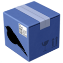

#  ILRepack.Fody

Fody Weaver using ILRepack to merge dependency assemblies into the target assembly.

Note: the NuGet package is called **KageKirin.ILRepack.Fody** to allow alternative implementations.

## ⚡ Usage

### Add Fody and ILRepack.Fody

```xml
<Project>
  <PackageReference Include="Fody" Version="6.9.2" />
  <PackageReference Include="KageKirin.ILRepack.Fody" Version="0.0.0" />
</Project>
```

### 🔧 Add to FodyWeavers.xml

Add `<ILRepack />` to FodyWeavers.xml

```xml
<Weavers>
  <ILRepack />
</Weavers>
```

### 🔨 Configure `<ILRepack />`

TBD

## 🤝 Collaborate with My Project

Please refer to [COLLABORATION.md](COLLABORATION.md).
